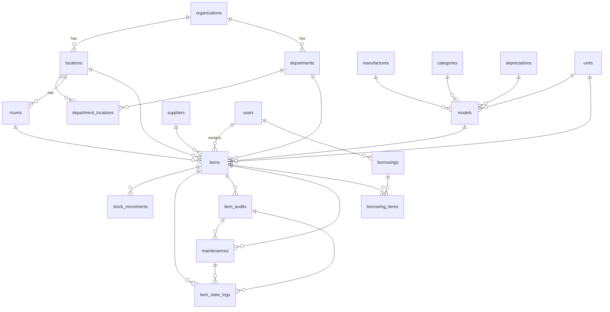

# Struktur Database — LIMAS

Dokumentasi tabel inti bisnis aplikasi manajemen aset/inventori. Semua tabel bisnis memakai **UUID** sebagai primary key.

**Dikecualikan dari dokumen ini:** `sessions`, `jobs`, `cache`, `password_reset_tokens`, `oauth_*`, `notifications`, `imports`/`exports`, tabel Spatie Permission, `activity_log`, `media`.

---

## Ringkasan Domain

| Kelompok | Tabel |
|----------|-------|
| Organisasi & Lokasi | `organizations`, `locations`, `departments`, `department_locations`, `rooms` |
| Master Aset | `categories`, `manufactures`, `models`, `depreciations`, `units`, `suppliers` |
| Referensi Geografis | `countries`, `provinces`, `cities` |
| Inventori | `items`, `stock_movements` |
| Operasional | `item_audits`, `maintenances`, `item_state_logs`, `borrowings`, `borrowing_items` |
| Pengguna | `users` |

---

## Diagram Relasi

---

## 1. Organisasi & Lokasi

### `organizations`

Perusahaan/institusi pemilik aset.

| Kolom | Tipe | Keterangan |
|-------|------|------------|
| `id` | uuid | PK |
| `name` | string | NOT NULL |
| `email` | string | nullable |
| `phone` | string(20) | nullable |
| `notes` | text | nullable |
| `created_at`, `updated_at` | timestamp | |
| `deleted_at` | timestamp | soft delete |

**Relasi:** `hasMany` → `locations`, `departments`

---

### `locations`

Cabang/kantor di bawah organisasi.

| Kolom | Tipe | Keterangan |
|-------|------|------------|
| `id` | uuid | PK |
| `organization_id` | uuid | FK → `organizations.id`, NOT NULL |
| `name` | string | NOT NULL |
| `address`, `address2` | string | nullable |
| `city` | string(20) | nullable |
| `province` | string(20) | nullable |
| `country` | string(20) | nullable |
| `zip` | string | nullable |
| `phone` | string(20) | nullable |
| `notes` | text | nullable |
| `created_at`, `updated_at` | timestamp | |
| `deleted_at` | timestamp | soft delete |

**Relasi:** `belongsTo` → `organizations` · `hasMany` → `rooms`, `items`, `department_locations`

---

### `departments`

Departemen/unit kerja.

| Kolom | Tipe | Keterangan |
|-------|------|------------|
| `id` | uuid | PK |
| `organization_id` | uuid | FK → `organizations.id`, nullable |
| `name` | string | NOT NULL |
| `phone` | string(20) | nullable |
| `notes` | text | nullable |
| `created_at`, `updated_at` | timestamp | |
| `deleted_at` | timestamp | soft delete |

**Relasi:** `belongsTo` → `organizations` · `belongsToMany` → `locations` (via `department_locations`) · `hasMany` → `items`

---

### `department_locations`

Pivot many-to-many antara departemen dan lokasi.

| Kolom | Tipe | Keterangan |
|-------|------|------------|
| `id` | uuid | PK |
| `department_id` | uuid | FK → `departments.id`, NOT NULL |
| `location_id` | uuid | FK → `locations.id`, NOT NULL |
| `created_at`, `updated_at` | timestamp | |

---

### `rooms`

Ruangan di dalam lokasi.

| Kolom | Tipe | Keterangan |
|-------|------|------------|
| `id` | uuid | PK |
| `location_id` | uuid | FK → `locations.id`, nullable, ON DELETE SET NULL |
| `name` | string | NOT NULL |
| `capacity` | integer | default 0 |
| `notes` | text | nullable |
| `created_at`, `updated_at` | timestamp | |
| `deleted_at` | timestamp | soft delete |

**Relasi:** `belongsTo` → `locations` · `hasMany` → `items`

---

## 2. Master Aset

### `categories`

Klasifikasi jenis aset.

| Kolom | Tipe | Keterangan |
|-------|------|------------|
| `id` | uuid | PK |
| `name` | string / CITEXT (pgsql) | NOT NULL |
| `type` | string(20) | NOT NULL — enum `CategoryType` |
| `notes` | text | nullable |
| `created_at`, `updated_at` | timestamp | |
| `deleted_at` | timestamp | soft delete |

**Enum `type`:** `asset`, `accessory`, `consumable`, `license`

**Relasi:** `hasMany` → `models`

---

### `manufactures`

Produsen/vendor perangkat.

| Kolom | Tipe | Keterangan |
|-------|------|------------|
| `id` | uuid | PK |
| `name` | string / CITEXT (pgsql) | NOT NULL |
| `url`, `support_url`, `support_email`, `warranty_lookup_url` | string | nullable |
| `support_phone` | string | nullable |
| `notes` | text | nullable |
| `created_at`, `updated_at` | timestamp | |
| `deleted_at` | timestamp | soft delete |

**Relasi:** `hasMany` → `models`

---

### `depreciations`

Skema penyusutan aset.

| Kolom | Tipe | Keterangan |
|-------|------|------------|
| `id` | uuid | PK |
| `name` | string | NOT NULL |
| `months` | integer | NOT NULL |
| `minimum_value` | decimal(10,2) | NOT NULL — persentase nilai minimum |
| `method` | string(20) | NOT NULL — enum `DepreciationMethod` |
| `notes` | text | nullable |
| `created_at`, `updated_at` | timestamp | |
| `deleted_at` | timestamp | soft delete |

**Enum `method`:** `amount` (straight line)

**Relasi:** `hasMany` → `models`

---

### `units`

Satuan pengukuran (pcs, box, dll).

| Kolom | Tipe | Keterangan |
|-------|------|------------|
| `id` | uuid | PK |
| `name` | string(20) / CITEXT (pgsql) | NOT NULL |
| `created_at`, `updated_at` | timestamp | |

**Relasi:** `hasMany` → `models`, `items`

---

### `models`

Template/spesifikasi produk aset.

| Kolom | Tipe | Keterangan |
|-------|------|------------|
| `id` | uuid | PK |
| `name` | string | NOT NULL |
| `model_number` | string | nullable |
| `min_amount` | integer | nullable — stok minimum untuk alert |
| `end_of_life` | integer | nullable — umur pakai (bulan) |
| `audit_interval` | integer | nullable — interval audit (bulan) |
| `manufacture_id` | uuid | FK → `manufactures.id`, nullable |
| `category_id` | uuid | FK → `categories.id`, nullable |
| `depreciation_id` | uuid | FK → `depreciations.id`, nullable |
| `unit_id` | uuid | FK → `units.id`, nullable |
| `notes` | text | nullable |
| `created_at`, `updated_at` | timestamp | |
| `deleted_at` | timestamp | soft delete |

**Relasi:** `belongsTo` → `manufactures`, `categories`, `depreciations`, `units` · `hasMany` → `items`

---

### `suppliers`

Pemasok/vendor pengadaan.

| Kolom | Tipe | Keterangan |
|-------|------|------------|
| `id` | uuid | PK |
| `name` | string / CITEXT (pgsql) | NOT NULL |
| `address`, `address2`, `city`, `zip`, `url` | string | nullable |
| `province` | string | nullable |
| `country` | string(20) | nullable |
| `phone` | string(20) | nullable |
| `email` | string(100) | nullable |
| `notes` | text | nullable |
| `created_at`, `updated_at` | timestamp | |
| `deleted_at` | timestamp | soft delete |

**Relasi:** `hasMany` → `items`

---

## 3. Referensi Geografis

Tabel lookup tanpa foreign key database — relasi logis via kode.

### `countries`

| Kolom | Tipe | Keterangan |
|-------|------|------------|
| `id` | uuid | PK |
| `name` | string | NOT NULL |
| `code` | string(5) | UNIQUE, NOT NULL |
| `created_at`, `updated_at` | timestamp | |

### `provinces`

| Kolom | Tipe | Keterangan |
|-------|------|------------|
| `id` | uuid | PK |
| `name` | string | NOT NULL |
| `code` | string(10) | NOT NULL |
| `country_code` | string(10) | NOT NULL — referensi `countries.code` |
| `created_at`, `updated_at` | timestamp | |

### `cities`

| Kolom | Tipe | Keterangan |
|-------|------|------------|
| `id` | uuid | PK |
| `name` | string | NOT NULL |
| `code` | string(10) | NOT NULL |
| `province_code` | string(10) | NOT NULL — referensi `provinces.code` |
| `created_at`, `updated_at` | timestamp | |

---

## 4. Inventori

### `items`

Unit aset individual — pusat inventori.

| Kolom | Tipe | Keterangan |
|-------|------|------------|
| `id` | uuid | PK |
| `user_id` | uuid | FK → `users.id`, nullable — penanggung jawab |
| `model_id` | uuid | FK → `models.id`, NOT NULL |
| `location_id` | uuid | FK → `locations.id`, NOT NULL |
| `department_id` | uuid | FK → `departments.id`, nullable |
| `supplier_id` | uuid | FK → `suppliers.id`, nullable |
| `room_id` | uuid | FK → `rooms.id`, nullable |
| `unit_id` | uuid | FK → `units.id`, nullable |
| `name` | string | nullable |
| `serial_number` | string | UNIQUE, NOT NULL |
| `quantity` | integer | default 1 |
| `purchase_date` | datetime | nullable |
| `purchase_price` | decimal(10,2) | nullable |
| `eol_date` | datetime | nullable |
| `warranty_months` | integer | nullable |
| `is_individual_tracking` | boolean | default true |
| `status` | string(20) | NOT NULL — enum `ItemStatus` |
| `notes` | text | nullable |
| `status_updated_at` | timestamp | nullable |
| `last_audit_date` | datetime | nullable |
| `next_audit_date` | datetime | nullable |
| `created_at`, `updated_at` | timestamp | |
| `deleted_at` | timestamp | soft delete |

**Enum `status`:** `active`, `under_diagnosis`, `under_repair`, `damaged`, `irreparable`, `lost`, `stolen`, `archived`, `disposed`

**Relasi:** `belongsTo` → `users`, `models`, `locations`, `departments`, `suppliers`, `rooms`, `units` · `hasMany` → `stock_movements`, `item_state_logs`, `item_audits`, `maintenances`, `borrowing_items`

---

### `stock_movements`

Pergerakan stok untuk item consumable.

| Kolom | Tipe | Keterangan |
|-------|------|------------|
| `id` | uuid | PK |
| `item_id` | uuid | FK → `items.id`, NOT NULL |
| `type` | string(20) | NOT NULL — enum `StockMovementType` |
| `quantity` | integer | NOT NULL — positif/negatif sesuai tipe |
| `notes` | text | nullable |
| `created_at`, `updated_at` | timestamp | |
| `deleted_at` | timestamp | soft delete |

**Enum `type`:** `in`, `out`, `adjustment`

**Relasi:** `belongsTo` → `items`

---

## 5. Operasional

### `item_audits`

Catatan audit/inspeksi aset.

| Kolom | Tipe | Keterangan |
|-------|------|------------|
| `id` | uuid | PK |
| `item_id` | uuid | FK → `items.id`, NOT NULL |
| `status` | string(20) | nullable — `passed`, `failed` |
| `condition` | string(50) | nullable — enum `ItemAuditCondition` |
| `result` | string(50) | nullable — enum `ItemAuditResult` |
| `location_verified` | boolean | default false |
| `notes` | text | nullable |
| `audited_at` | datetime | NOT NULL |
| `next_audit_at` | datetime | nullable |
| `created_at`, `updated_at` | timestamp | |
| `deleted_at` | timestamp | soft delete |

**Enum `condition`:** `excellent`, `good`, `fair`, `poor`, `unusable`

**Enum `result`:** `ok`, `needs_maintenance`, `needs_replacement`, `dispose`

**Relasi:** `belongsTo` → `items` · `hasMany` → `maintenances`, `item_state_logs`

---

### `maintenances`

Perawatan/perbaikan aset.

| Kolom | Tipe | Keterangan |
|-------|------|------------|
| `id` | uuid | PK |
| `item_id` | uuid | FK → `items.id`, NOT NULL |
| `item_audit_id` | uuid | FK → `item_audits.id`, nullable |
| `type` | string(20) | NOT NULL — enum `MaintenanceType` |
| `status` | string(20) | nullable — enum `MaintenanceStatus` |
| `reported_at` | datetime | nullable |
| `started_at` | datetime | nullable |
| `completed_at` | datetime | nullable |
| `cost` | decimal(10,2) | nullable |
| `notes` | text | nullable |
| `created_at`, `updated_at` | timestamp | |
| `deleted_at` | timestamp | soft delete |

**Enum `type`:** `preventive`, `repair`, `upgrade`, `inspection`

**Enum `status`:** `reported`, `in_progress`, `completed`, `cancelled`

**Relasi:** `belongsTo` → `items`, `item_audits` · `hasMany` → `item_state_logs`

---

### `item_state_logs`

Jejak perubahan lokasi, penugasan, dan status aset.

| Kolom | Tipe | Keterangan |
|-------|------|------------|
| `id` | uuid | PK |
| `item_id` | uuid | FK → `items.id`, NOT NULL |
| `item_audit_id` | uuid | FK → `item_audits.id`, nullable |
| `maintenance_id` | uuid | FK → `maintenances.id`, nullable |
| `event_type` | string(50) | NOT NULL — enum `ItemStateEventType` |
| `from_location_id` | uuid | FK → `locations.id`, nullable |
| `to_location_id` | uuid | FK → `locations.id`, nullable |
| `from_department_id` | uuid | FK → `departments.id`, nullable |
| `to_department_id` | uuid | FK → `departments.id`, nullable |
| `from_room_id` | uuid | FK → `rooms.id`, nullable |
| `to_room_id` | uuid | FK → `rooms.id`, nullable |
| `from_user_id` | uuid | FK → `users.id`, nullable |
| `to_user_id` | uuid | FK → `users.id`, nullable |
| `from_status` | string(20) | nullable |
| `to_status` | string(20) | nullable |
| `notes` | text | nullable |
| `created_at`, `updated_at` | timestamp | |
| `deleted_at` | timestamp | soft delete |

**Enum `event_type`:** `transfer`, `assignment`, `status_change`

**Relasi:** `belongsTo` → `items`, `item_audits`, `maintenances`, `locations`, `departments`, `rooms`, `users`

---

### `borrowings`

Transaksi peminjaman aset oleh pengguna.

| Kolom | Tipe | Keterangan |
|-------|------|------------|
| `id` | uuid | PK |
| `user_id` | uuid | FK → `users.id`, NOT NULL |
| `borrowed_at` | datetime | NOT NULL |
| `due_at` | datetime | NOT NULL |
| `returned_at` | datetime | nullable |
| `status` | string(20) | NOT NULL — enum `BorrowingStatus` |
| `notes` | text | nullable |
| `created_at`, `updated_at` | timestamp | |
| `deleted_at` | timestamp | soft delete |

**Enum `status`:** `active`, `returned`

**Relasi:** `belongsTo` → `users` · `hasMany` → `borrowing_items`

---

### `borrowing_items`

Detail item yang dipinjam dalam satu transaksi.

| Kolom | Tipe | Keterangan |
|-------|------|------------|
| `id` | uuid | PK |
| `borrowing_id` | uuid | FK → `borrowings.id`, NOT NULL |
| `item_id` | uuid | FK → `items.id`, NOT NULL |
| `quantity` | integer | NOT NULL |
| `checked_out_at` | datetime | NOT NULL |
| `checked_in_at` | datetime | nullable |
| `condition_out` | string(20) | NOT NULL — enum `ItemAuditCondition` |
| `condition_in` | string(20) | nullable — enum `ItemAuditCondition` |
| `notes` | text | nullable |
| `created_at`, `updated_at` | timestamp | |
| `deleted_at` | timestamp | soft delete |

**Unique:** `(borrowing_id, item_id)`

**Relasi:** `belongsTo` → `borrowings`, `items`

---

## 6. Pengguna

### `users`

Pengguna sistem — hanya kolom inti bisnis yang didokumentasikan.

| Kolom | Tipe | Keterangan |
|-------|------|------------|
| `id` | uuid | PK |
| `name` | string | NOT NULL |
| `email` | string | UNIQUE, NOT NULL |

> Kolom autentikasi (`password`, `two_factor_*`, `oauth`, dll.) ada di database tetapi di luar cakupan dokumen ini.

**Relasi:** `hasMany` → `items`, `borrowings`

---

## Catatan Teknis

- **PostgreSQL:** kolom `name` pada `categories`, `units`, `manufactures`, `suppliers` memakai tipe `CITEXT` (case-insensitive).
- **Rename historis:** `companies` → `organizations`, `deprecations` → `depreciations`.
- **Soft delete:** sebagian besar tabel master dan transaksi memiliki `deleted_at`. Tabel pivot (`department_locations`) dan referensi geografis tidak memakai soft delete.
- **Model vs migrasi:** beberapa model belum memakai trait `SoftDeletes` meskipun kolom `deleted_at` ada di migrasi (mis. `Organization`, `Borrowing`).
