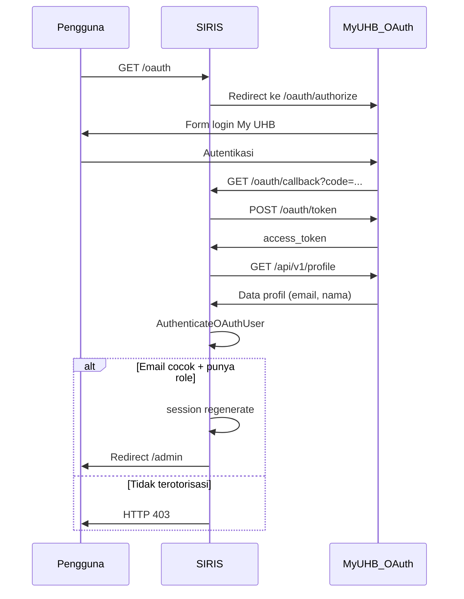

# SSO My UHB

SIRIS mendukung login tunggal (SSO) melalui server OAuth My UHB menggunakan Laravel Socialite dengan provider kustom.

## Route

| Method | Path | Nama Route | Handler |
|--------|------|------------|---------|
| GET | `/oauth` | `oauth.login` | Redirect ke server OAuth |
| GET | `/oauth/callback` | `oauth.callback` | Proses callback |

Kedua route berada di middleware `guest` (`routes/web.php`).

## Konfigurasi

File `config/oauth.php`:

```php
'name'    => env('OAUTH_NAME'),
'url'     => env('OAUTH_URL'),
'client_id'     => env('OAUTH_CLIENT_ID'),
'client_secret' => env('OAUTH_CLIENT_SECRET'),
```

Provider didaftarkan di `AppServiceProvider` sebagai driver Socialite `sso`.

## Alur OAuth



## SsoProvider

Class `App\Socialite\SsoProvider` mengimplementasikan OAuth2:

| Endpoint | URL |
|----------|-----|
| Authorize | `{OAUTH_URL}/oauth/authorize` |
| Token | `{OAUTH_URL}/oauth/token` |
| Profil | `{OAUTH_URL}/api/v1/profile` |

Request profil menyertakan header `Authorization: Bearer {token}` dan User-Agent yang dapat dikonfigurasi.

## AuthenticateOAuthUser

Action `App\Actions\Auth\AuthenticateOAuthUser`:

1. Cari user by email dengan `whereHas('roles')`
2. Jika tidak ditemukan → return `null` → controller melempar 403
3. Set `session(['auth_login_method' => 'sso'])`
4. `Auth::login($user)`

> {warning} Tidak ada auto-registrasi
>
> SSO **tidak** membuat akun baru. Email dari OAuth harus sudah terdaftar di SIRIS dengan role yang sesuai.

## Penanganan Error

`SsoController::callback` menangani skenario berikut:

| Kondisi | Respons |
|---------|---------|
| Parameter `error` dari OAuth | Redirect login + pesan `auth.oauth_denied` |
| `InvalidStateException` | Redirect login + `auth.oauth_invalid_state` |
| Exception lain | Log warning + `auth.oauth_failed` |
| Email kosong dari profil | `auth.oauth_missing_email` |
| User tidak ditemukan / tanpa role | HTTP 403 `auth.oauth_unauthorized` |

## Keamanan

- Session di-regenerate setelah login SSO berhasil
- State OAuth divalidasi oleh Socialite (`InvalidStateException`)
- Hanya user ber-role yang dapat masuk

## Menampilkan Tombol SSO

Tombol SSO di halaman login muncul jika:

- `config('oauth.client_id')` tidak kosong
- Route `oauth.login` terdaftar

## Langkah Selanjutnya

- [Konfigurasi OAuth](/{{route}}/{{version}}/memulai/konfigurasi)
- [Gambaran Autentikasi](/{{route}}/{{version}}/autentikasi/gambaran-umum)
