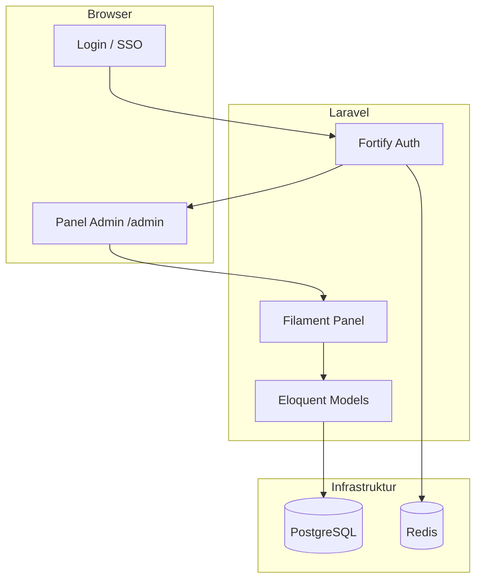

# Pengenalan

SIRIS dirancang untuk menggantikan pencatatan inventori manual dengan sistem terpusat yang dapat diaudit. Aplikasi ini ditujukan bagi:

- **Administrator inventori** — mengelola data aset, stok, dan master data
- **Operator** — mencatat peminjaman, audit, dan pergerakan stok sehari-hari
- **Super Admin** — mengatur pengguna, peran, dan konfigurasi sistem

## Tujuan

1. Menyediakan **sumber kebenaran tunggal** untuk posisi dan status setiap aset
2. Mencatat **jejak audit** setiap perubahan lokasi, penugasan, dan status
3. Memberikan **peringatan proaktif** — audit jatuh tempo, stok minimum, maintenance terbuka
4. Mendukung **pelaporan** — ekspor data, nilai buku depresiasi, riwayat aktivitas

## Arsitektur Singkat

## Panel Aplikasi

SIRIS memiliki dua panel Filament:

| Panel | Path | Status |
|-------|------|--------|
| **Admin** | `/admin` | Aktif — seluruh modul bisnis |
| **App** | `/app` | Scaffold — belum berisi resource |

Semua dokumentasi modul merujuk pada panel **Admin**.

## Bahasa Antarmuka

Aplikasi mendukung bahasa **Indonesia** (default) dan **Inggris** melalui paket `filament-language-switch`. Terjemahan berada di folder `lang/id/` dan `lang/en/`.

## Langkah Selanjutnya

- [Instalasi](/{{route}}/{{version}}/memulai/instalasi) — menyiapkan lingkungan pengembangan
- [Konfigurasi](/{{route}}/{{version}}/memulai/konfigurasi) — variabel lingkungan penting
