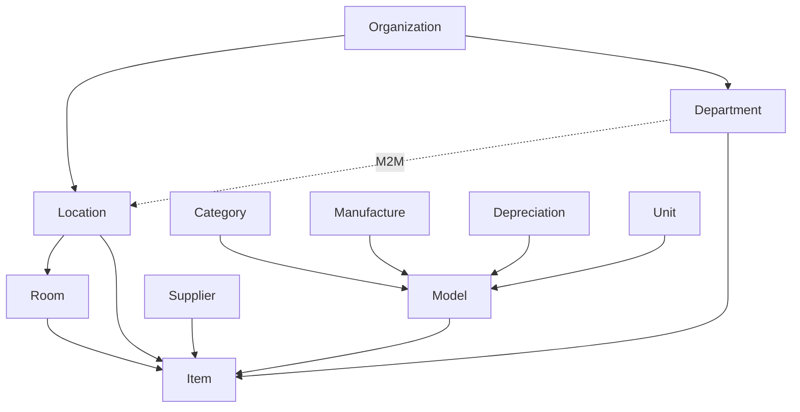

# Data Master

Kumpulan resource untuk data referensi dan struktur organisasi.

## Organisasi & Lokasi

### Organizations (`OrganizationResource`)

Institusi pemilik aset.

| Field | Keterangan |
|-------|------------|
| `name` | Nama organisasi |
| `email`, `phone` | Kontak |
| `notes` | Catatan |

**Relasi:** `hasMany` locations, departments

### Locations (`LocationResource`)

Cabang/kantor di bawah organisasi.

| Field | Keterangan |
|-------|------------|
| `organization_id` | Organisasi induk |
| `name` | Nama lokasi |
| `address`, `city`, `province`, `country`, `zip` | Alamat |
| Referensi geo | `country`, `province`, `city` via kode lookup |

### Departments (`DepartmentResource`)

Unit kerja, dapat terhubung ke banyak lokasi (M2M via `department_locations`).

### Rooms (`RoomResource`)

Ruangan dalam lokasi.

| Field | Keterangan |
|-------|------------|
| `location_id` | Lokasi induk |
| `name` | Nama ruang |
| `capacity` | Kapasitas |

## Katalog Produk (Reference)

### Categories (`CategoryResource`)

| Field | Keterangan |
|-------|------------|
| `name` | Nama kategori |
| `type` | `asset`, `accessory`, `consumable`, `license` |

Import tersedia via `CategoryImporter`.

### Manufactures (`ManufactureResource`)

Data produsen: nama, URL dukungan, garansi lookup. Import via `ManufactureImporter`.

### Models (`ModelResource`)

Template spesifikasi produk.

| Field | Keterangan |
|-------|------------|
| `name`, `model_number` | Identifikasi produk |
| `category_id` | Kategori |
| `manufacture_id` | Produsen |
| `depreciation_id` | Skema depresiasi |
| `unit_id` | Satuan |
| `min_amount` | Stok minimum (alert) |
| `end_of_life` | Umur pakai (bulan) |
| `audit_interval` | Interval audit (bulan) |

Mendukung media (foto produk). Import via `ModelImporter`.

### Suppliers (`SupplierResource`)

Pemasok pengadaan dengan alamat dan kontak. Relasi geo lookup untuk negara/provinsi/kota.

## Keuangan & Satuan (Master Data)

### Depreciations (`DepreciationResource`)

Skema penyusutan straight-line.

| Field | Keterangan |
|-------|------------|
| `months` | Periode depresiasi |
| `minimum_value` | Persentase nilai residu minimum |
| `method` | `amount` (garis lurus) |

### Units (`UnitResource`)

Satuan pengukuran (pcs, box, set, dll.) — pola Manage dengan inline create/edit.

## Referensi Geografis

Tabel lookup tanpa FK database:

- `countries` — kode negara
- `provinces` — kode provinsi per negara
- `cities` — kode kota per provinsi

Digunakan oleh Location dan Supplier untuk autocomplete alamat.

## Hierarki

## Langkah Selanjutnya

- [Impor & Ekspor](/{{route}}/{{version}}/modul/impor-ekspor)
- [Referensi Database](/{{route}}/{{version}}/referensi/database)
