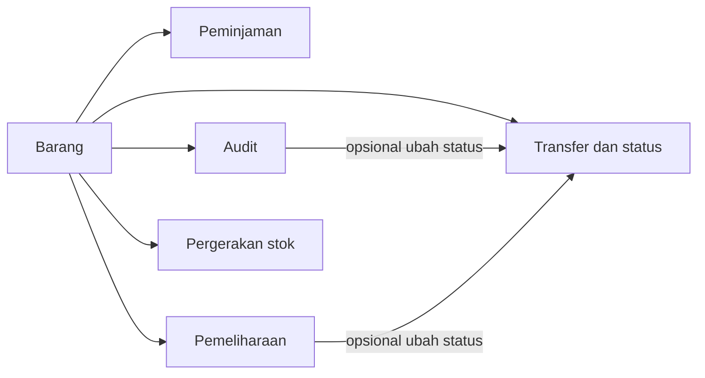

# Barang

Modul **Barang** adalah pusat inventori SIRIS. Di sini Anda mencatat aset institusi — baik per unit fisik (dengan nomor seri) maupun sebagai stok massal — beserta lokasi, status, dan riwayat terkait peminjaman, audit, pemeliharaan, stok, serta transfer.

---

- [Cara Membuka](#cara-membuka)
- [Konsep Barang](#konsep-barang)
- [Membuat Barang](#membuat-barang)
- [Melihat Detail Barang](#melihat-detail-barang)
- [Tab pada Detail Barang](#tab-pada-detail-barang)
- [Mengubah Barang](#mengubah-barang)
- [Menghapus Barang](#menghapus-barang)
- [Status Barang](#status-barang)
- [Kapan Memakai Modul Lain](#kapan-memakai-modul-lain)
- [Langkah Selanjutnya](#langkah-selanjutnya)

## Cara Membuka

1. Masuk ke panel admin SIRIS
2. Klik **Barang** di sidebar (grup **Fitur Utama**)

Akses modul ini memerlukan izin **Barang** (lihat daftar, buat, ubah, atau hapus sesuai peran Anda). Tanpa izin, menu **Barang** tidak muncul di sidebar.

## Konsep Barang

Setiap barang terhubung ke **model** dan **kategori** yang menentukan cara pelacakannya. Pahami perbedaan berikut sebelum mencatat inventori:

### Tipe kategori

| Tipe | Contoh | Pelacakan bawaan |
|------|--------|------------------|
| **Aset** | Laptop, proyektor | Individu (per unit) |
| **Aksesori** | Mouse, kabel | Individu (per unit) |
| **Habis pakai** | Kertas, tinta | Selalu stok massal |
| **Lisensi** | Software | Individu (per unit) |

### Pelacakan individu vs stok massal

| Mode | Arti | Kuantitas | Nomor seri |
|------|------|-----------|------------|
| **Pelacakan individu** | Setiap unit fisik = satu record barang terpisah | Selalu 1 | Unik (8 karakter, otomatis) |
| **Stok massal** | Satu record mewakili banyak unit di lokasi yang sama | Dijumlah dari pergerakan stok | Tidak per unit |

> {note} Kategori habis pakai
>
> Barang kategori **Habis pakai** selalu dicatat sebagai stok massal. Opsi pelacakan individu tidak tersedia untuk tipe ini.

Saat membuat barang stok massal, sistem otomatis mencatat **stok awal** sebesar kuantitas yang Anda isi. Tab **Stok** hanya muncul pada barang stok massal — tidak pada barang dengan pelacakan individu.

### Hubungan dengan modul lain

## Membuat Barang

1. Buka **Barang** → klik **Tambah Barang**
2. Pilih **Kategori**, lalu **Model** (model difilter menurut kategori)
3. Atur **Status** awal (bawaan: **Aktif**)
4. Untuk kategori selain habis pakai, tentukan **Pelacakan individu**:
   - **Aktif** — kuantitas pada setiap baris = jumlah unit terpisah yang akan dibuat
   - **Nonaktif** — kuantitas = stok awal untuk satu record di lokasi tersebut
5. Pada repeater lokasi, isi minimal satu baris:
   - **Lokasi** (wajib)
   - **Departemen** dan **Ruangan** (opsional)
   - **Kuantitas** (wajib, minimal 1)
6. Isi **Informasi pembelian** jika perlu: pemasok, tanggal pembelian, harga satuan, kadaluarsa, garansi
7. Klik **Simpan**

**Contoh kuantitas:**

- Pelacakan individu, kuantitas 5 di satu lokasi → 5 barang terpisah, masing-masing kuantitas 1 dengan nomor seri unik
- Stok massal, kuantitas 20 → 1 barang dengan stok awal 20

> {info} Data master
>
> Lokasi, departemen, ruangan, kategori, dan model harus sudah tercatat di data master/referensi sebelum Anda membuat barang.

## Melihat Detail Barang

Dari daftar barang, klik baris atau tombol **Lihat** untuk membuka halaman detail. Informasi ditampilkan dalam beberapa bagian:

- **Spesifikasi** — nomor seri, model, kategori, tipe, pelacakan individu, pabrikan, satuan, penyusutan, nama, catatan
- **Transfer** — status, kuantitas, lokasi, penanggung jawab, departemen, ruangan, tanggal audit terakhir/berikutnya
- **Informasi pembelian** — tanggal dan harga pembelian, nilai depresiasi, pemasok, kadaluarsa, garansi
- **QR code** — berdasarkan nomor seri, untuk pemindaian cepat dari dasbor
- **Gambar** — hingga 3 foto barang

Klik **Ubah** di pojok kanan atas untuk membuka form edit.

## Tab pada Detail Barang

Di bagian atas halaman detail, terdapat tab navigasi ke riwayat dan operasi terkait barang:

| Tab | Kegunaan singkat | Panduan lengkap |
|-----|------------------|-----------------|
| **Detail** | Ringkasan informasi barang | Halaman ini |
| **Peminjaman** | Riwayat barang yang pernah dipinjam (baca saja); klik transaksi untuk membuka detail peminjaman | [Peminjaman](/{{route}}/{{version}}/modul/peminjaman) |
| **Stok** | Catat stok masuk, keluar, dan penyesuaian — hanya untuk barang stok massal | [Pergerakan Stok](/{{route}}/{{version}}/modul/pergerakan-stok) |
| **Audit** | Catat hasil inspeksi fisik barang | [Audit Barang](/{{route}}/{{version}}/modul/audit) |
| **Pemeliharaan** | Kelola tiket perawatan dan perbaikan | [Pemeliharaan](/{{route}}/{{version}}/modul/maintenance) |
| **Transfer & status** | Catat perpindahan permanen lokasi, penugasan penanggung jawab, atau perubahan status | [Transfer & Status](/{{route}}/{{version}}/modul/riwayat-status) |

## Mengubah Barang

1. Buka detail barang → klik **Ubah**, atau klik **Ubah** langsung dari daftar
2. Perbarui field yang diizinkan
3. Klik **Simpan**

**Yang dapat diubah di form edit:**

- Kategori dan model
- Nama dan catatan
- Gambar (maks. 3 file)
- Informasi pembelian (pemasok, tanggal, harga, kadaluarsa, garansi)
- Kuantitas (hanya barang stok massal)

**Yang tidak dapat diubah langsung di form edit:**

| Field | Cara mengubah |
|-------|---------------|
| Nomor seri | Tidak dapat diubah setelah dibuat |
| Lokasi, departemen, ruangan | Tab **Transfer & status** → jenis **Transfer** |
| Penanggung jawab | Tab **Transfer & status** → jenis **Penugasan** |
| Status | Tab **Transfer & status** → jenis **Perubahan status**, atau lewat audit/pemeliharaan |

## Menghapus Barang

Penghapusan barang dilakukan dari halaman **Ubah** (tombol hapus di header) atau lewat aksi massal di daftar barang.

> {warning} Pembatasan penghapusan
>
> Barang **tidak dapat dihapus** jika sudah memiliki:
> - Riwayat **Transfer & status**
> - Catatan **Audit**
> - Catatan **Pemeliharaan**
> - Saldo **Stok** lebih dari 0
>
> Hapus atau sesuaikan data terkait terlebih dahulu jika penghapusan diperlukan.

Barang yang dihapus menggunakan **soft delete** — masih dapat dipulihkan lewat filter **Terhapus** di daftar barang, selama Anda memiliki izin pemulihan.

## Status Barang

| Status | Arti |
|--------|------|
| **Aktif** | Barang siap dipakai; satu-satunya status yang dapat dipinjam |
| **Sedang didiagnosis** | Sedang diperiksa untuk menentukan kerusakan |
| **Sedang diperbaiki** | Sedang dalam proses perbaikan |
| **Rusak** | Rusak namun masih tercatat |
| **Tidak dapat diperbaiki** | Kerusakan permanen |
| **Hilang** | Barang tidak ditemukan |
| **Dicuri** | Barang hilang karena pencurian |
| **Diarsipkan** | Tidak aktif, diarsipkan |
| **Dimusnahkan** | Sudah dibuang/dimusnahkan |

Status **Hilang**, **Dicuri**, **Diarsipkan**, dan **Dimusnahkan** tidak dihitung dalam ringkasan inventori aktif di dasbor.

## Kapan Memakai Modul Lain

| Situasi | Modul yang digunakan |
|---------|---------------------|
| Memindahkan laptop ke ruang rapat selama 3 hari | [Peminjaman](/{{route}}/{{version}}/modul/peminjaman) |
| Memindahkan laptop ke departemen lain secara permanen | [Transfer & Status](/{{route}}/{{version}}/modul/riwayat-status) |
| Mencatat stok kertas masuk dari pengadaan | [Pergerakan Stok](/{{route}}/{{version}}/modul/pergerakan-stok) |
| Inspeksi fisik berkala terhadap aset | [Audit Barang](/{{route}}/{{version}}/modul/audit) |
| Melaporkan kerusakan atau jadwal perawatan | [Pemeliharaan](/{{route}}/{{version}}/modul/maintenance) |

## Langkah Selanjutnya

- [Peminjaman](/{{route}}/{{version}}/modul/peminjaman)
- [Audit Barang](/{{route}}/{{version}}/modul/audit)
- [Pemeliharaan](/{{route}}/{{version}}/modul/maintenance)
- [Pergerakan Stok](/{{route}}/{{version}}/modul/pergerakan-stok)
- [Transfer & Status](/{{route}}/{{version}}/modul/riwayat-status)
