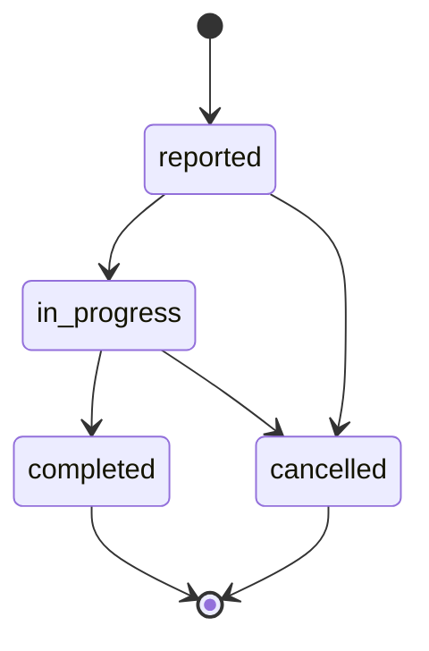

# Maintenance

Modul perawatan dan perbaikan aset.

**Resource:** `MaintenanceResource` · **Model:** `App\Models\Maintenance`

## Halaman

Pola **Manage** — list, view, filter. Tiket baru dibuat dari sub-halaman Item atau dari hasil audit.

## Data Maintenance

| Field | Keterangan |
|-------|------------|
| `item_id` | Item yang dirawat |
| `item_audit_id` | Audit pemicu (opsional) |
| `type` | Tipe — lihat [MaintenanceType](/{{route}}/{{version}}/referensi/enum#maintenancetype) |
| `status` | Status — lihat [MaintenanceStatus](/{{route}}/{{version}}/referensi/enum#maintenancestatus) |
| `reported_at` | Waktu dilaporkan |
| `started_at` | Waktu mulai pengerjaan |
| `completed_at` | Waktu selesai |
| `cost` | Biaya perbaikan (IDR) |
| `notes` | Catatan teknisi |

## Siklus Status

## Tipe Maintenance

| Tipe | Keterangan |
|------|------------|
| `preventive` | Perawatan berkala |
| `repair` | Perbaikan kerusakan |
| `upgrade` | Peningkatan spesifikasi |
| `inspection` | Inspeksi teknis |

## Dashboard

Widget **Maintenance belum selesai** menghitung tiket dengan status `reported` atau `in_progress`. Grafik **MaintenanceByTypeChart** menampilkan distribusi per tipe.

## Ekspor

`MaintenanceExporter` — ekspor data maintenance.

## Relasi

- Terkait **Item Audit** jika dibuat dari hasil inspeksi
- Perubahan status item dapat tercatat di **Item State Logs**

## Langkah Selanjutnya

- [Pergerakan Stok](/{{route}}/{{version}}/modul/pergerakan-stok)
- [Referensi Database](/{{route}}/{{version}}/referensi/database#maintenances)
