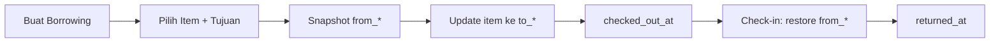

# Peminjaman

Modul untuk **pemindahan posisi sementara** aset ke lokasi lain, kemudian mengembalikannya ke posisi semula.

**Resource:** `BorrowingResource` · **Model:** `App\Models\Borrowing`, `BorrowingItem`

## Konsep

Peminjaman di SIRIS bukan modul event — ini adalah mekanisme untuk:

1. Memindahkan aset sementara (laptop, proyektor, kursi, dll.)
2. Mencatat snapshot posisi asal (`from_*`)
3. Mengupdate posisi item ke tujuan (`to_*`)
4. Mengembalikan ke posisi asal saat check-in

## Halaman

| Halaman | Keterangan |
|---------|------------|
| List | Daftar transaksi peminjaman |
| Create | Form kustom dengan pemilih item (tabel + qty) |
| View | Detail transaksi + items |
| Edit | Ubah data transaksi |

## Data Header (`borrowings`)

| Field | Keterangan |
|-------|------------|
| `user_id` | Admin pencatat (opsional) |
| `to_location_id` | Tujuan sementara — lokasi |
| `to_department_id` | Tujuan — departemen |
| `to_room_id` | Tujuan — ruang |
| `borrowed_at` | Waktu mulai |
| `due_at` | Batas pengembalian |
| `returned_at` | Waktu semua item kembali |
| `status` | `active` atau `returned` |
| `notes` | Keterangan bebas (alasan, acara, PIC) |

Minimal satu dari `to_location_id`, `to_department_id`, `to_room_id` wajib diisi.

## Data Line Item (`borrowing_items`)

| Field | Keterangan |
|-------|------------|
| `item_id` | Aset yang dipinjam |
| `quantity` | Jumlah unit |
| `from_location_id` | Snapshot lokasi asal |
| `from_department_id` | Snapshot departemen asal |
| `from_room_id` | Snapshot ruang asal |
| `to_*` | Override tujuan per item (default dari header) |
| `checked_out_at` | Waktu keluar |
| `checked_in_at` | Waktu kembali |
| `condition_out` / `condition_in` | Kondisi fisik saat keluar/masuk |

## Alur Bisnis

1. **Buat** — pilih item, tujuan sementara, tanggal, catatan
2. **Keluar** — simpan `from_*`, update `items` ke `to_*`, set `checked_out_at`
3. **Kembali** — restore posisi dari `from_*`, set `checked_in_at`
4. Semua line selesai → `status = returned`, `returned_at = now()`

## Overdue

Transaksi dianggap terlambat jika `due_at` sudah lewat dan masih ada item tanpa `checked_in_at`.

## Relation Manager

`ItemsRelationManager` pada halaman View/Edit Borrowing mengelola line items.

## Laporan

**BorrowingItemResource** (grup Reports) menampilkan semua line item peminjaman dengan opsi ekspor (`BorrowingItemExporter`).

## Langkah Selanjutnya

- [Audit](/{{route}}/{{version}}/modul/audit)
- [Referensi Database](/{{route}}/{{version}}/referensi/database#borrowings)
